# Ola Bem-Vindo ao Codificador (GCrypter)

```
Ele é uma Ferramenta util e Pratica Para Quem Gosta de Manter os Seus Arquivos
Muito Bem Protegidos Sem Ter que se Preocupar
Com Possiveis Invasões ou Ate Divulgacões Indesejadas..

- O Codificador (GCrypter) lhe Oferece Opcões e um Ambiente Simples
    Para que Você como Utilizador Final Possa Registrar os Seus Pensamentos,
    Dados e Anotacões, Guardando-os Posteriormente CODIFICADOS..
- Nele Tambem Esta a Opcão de DECODIFICACÃO dos Mesmos Arquivos..
- E até a opcão de EDICÃO dos arquivos já criados..
```

_**Muito Obrigado Pelo Apoio! \
Faca Bom Proveito!**_

---

# Demonstrações

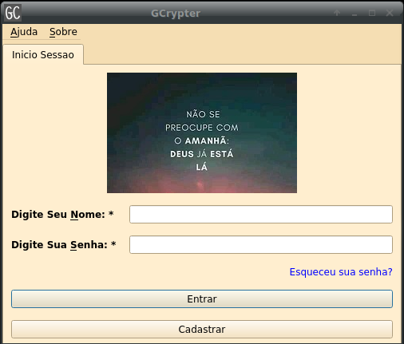
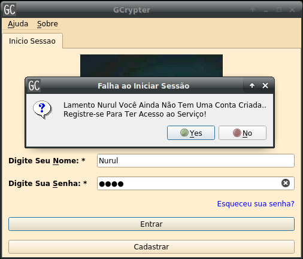

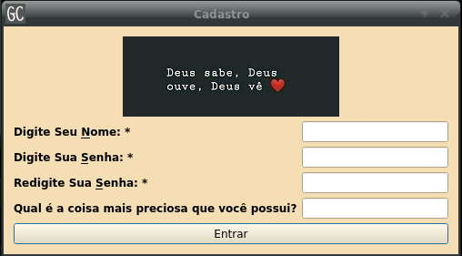
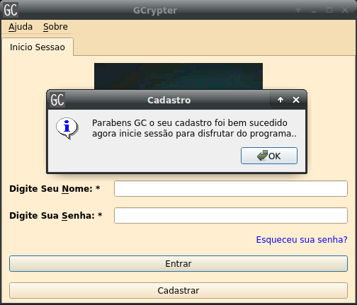
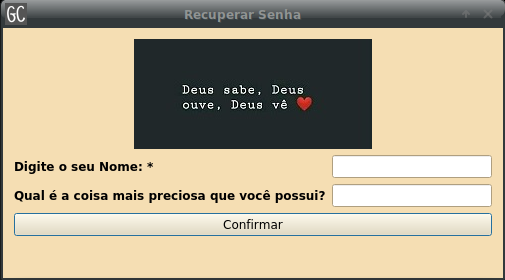

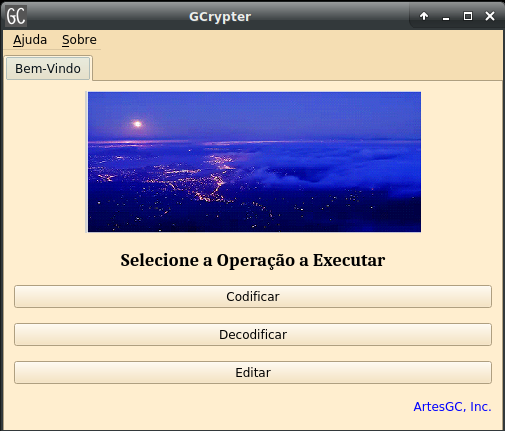
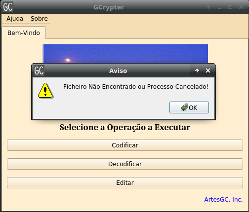

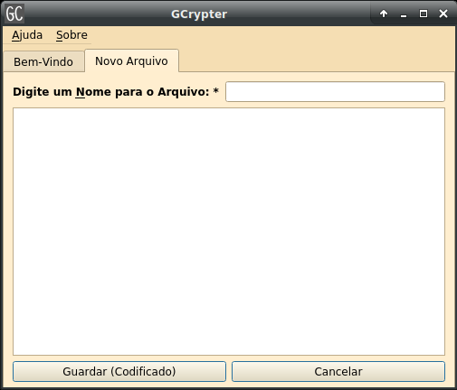
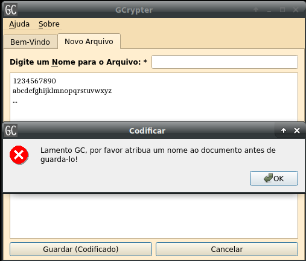
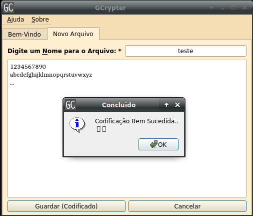
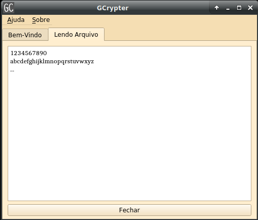
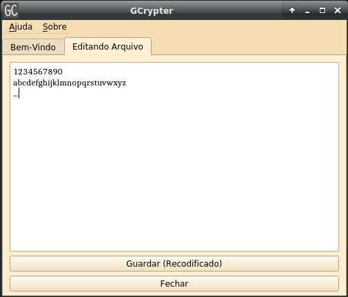

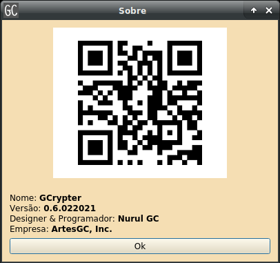

---
&copy; 2019-2021 [Nurul Carvalho](mailto:nuruldecarvalho@gmail.com) \
&trade; [ArtesGC](https://artesgc.home.blog)
