<div align="center">

  
[](https://sourceforge.net/projects/gcrypter/files/latest/download) \
[](https://sourceforge.net/projects/gcrypter/files/latest/download) \
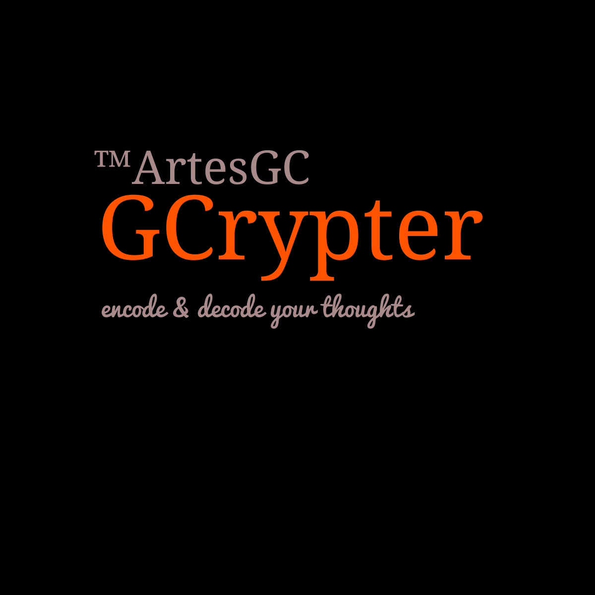

# Hello Welcome to the (GCrypter)

```txt
It is a useful and practical tool for those
who like to keep their files very well protected
without having to worry about possible invasions
or even unwanted disclosures.

- The encoder (GCrypter) offers you options and a simple environment
for you as a user Final You can register your thoughts,
data and notes, keeping them afterwards ENCODED ..
- There is also the DECODING option for the same files ..
- And even the EDITION option of the files already created ..
```

_**Thank you very much for your support! \
Enjoy!**_

</div>

---

# _Demos_

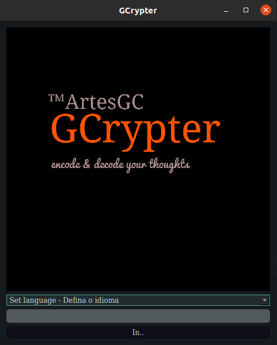
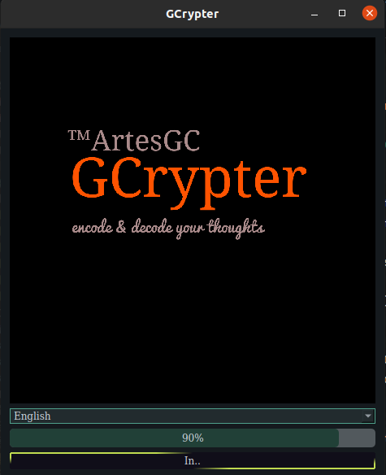
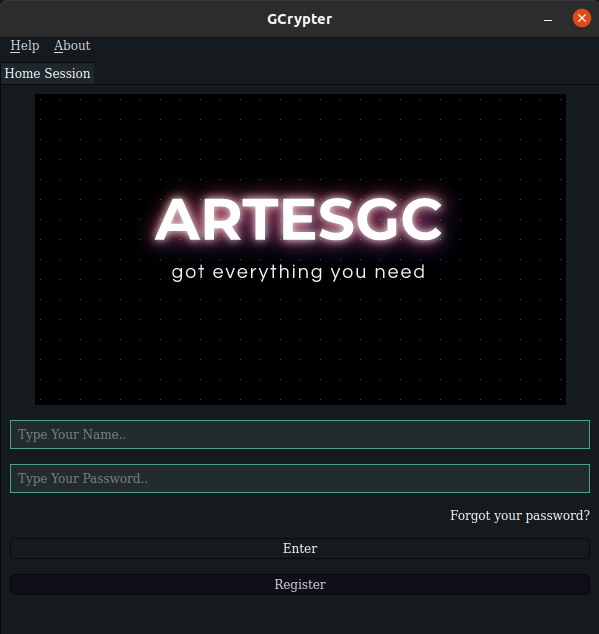
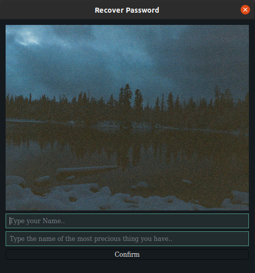
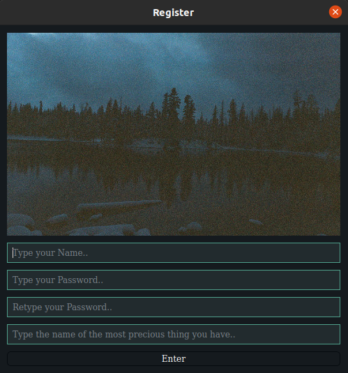
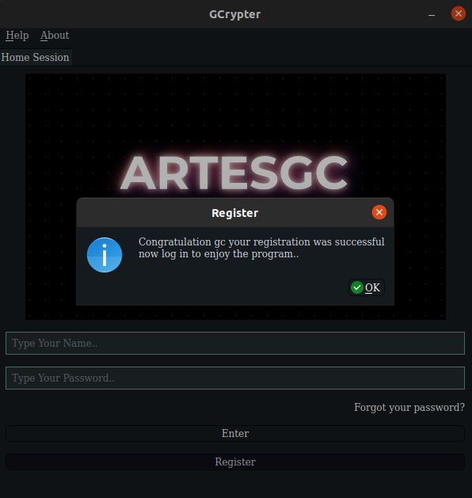
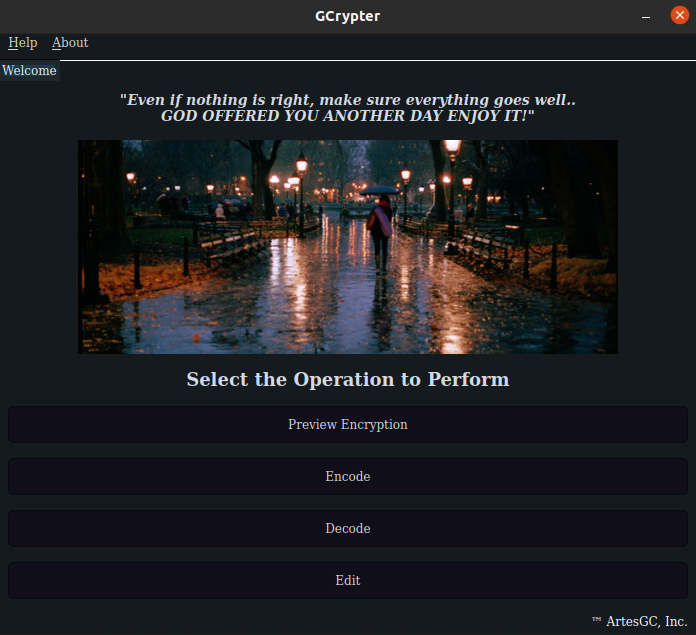
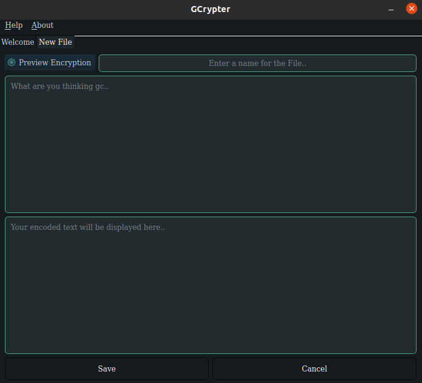
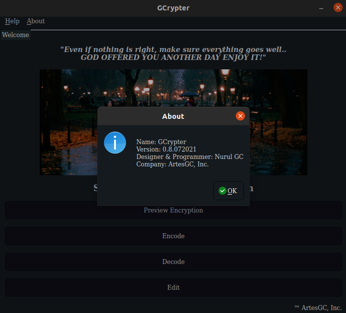
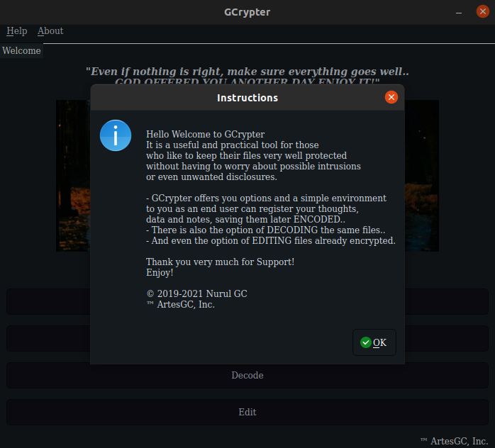

# _LANGUAGES' SUPPORT_

| Portugues | English |
| --- | --- |
| :100: | :100: |

---

&copy; 2019-2021 [Nurul Carvalho](mailto:nuruldecarvalho@gmail.com) \
&trade; [ArtesGC](https://artesgc.home.blog)
